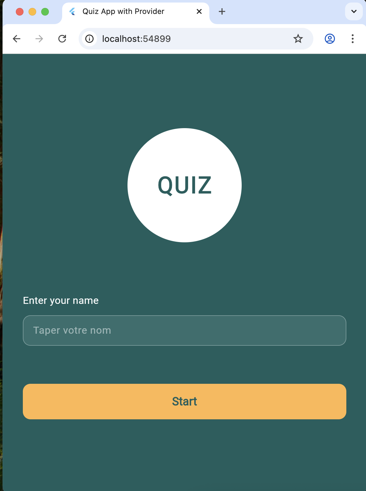
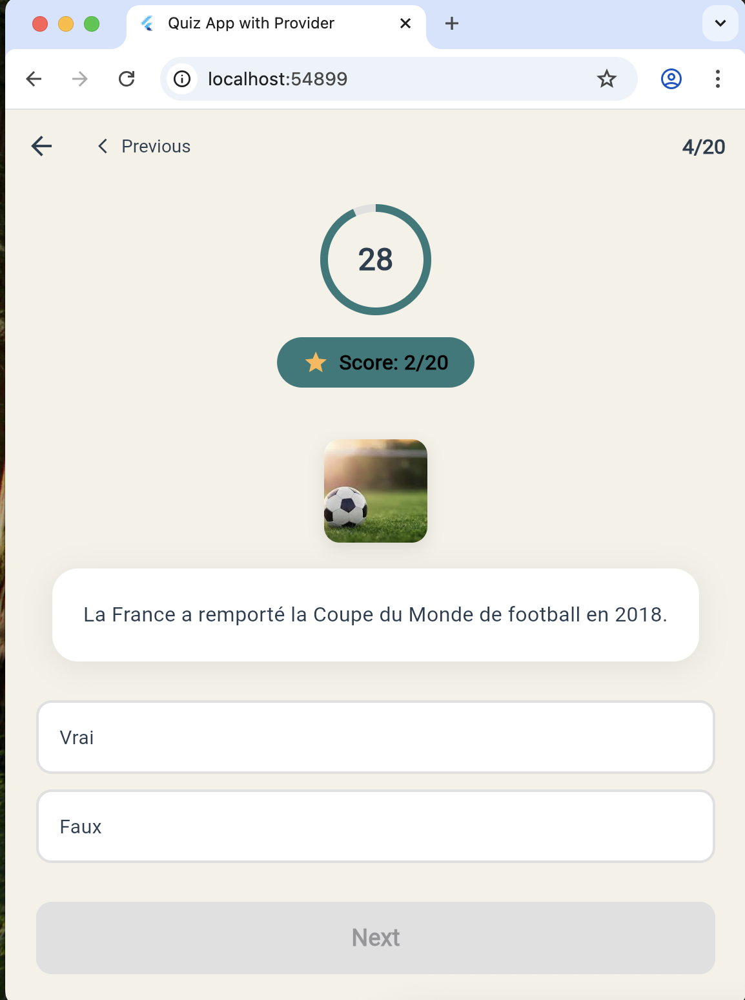
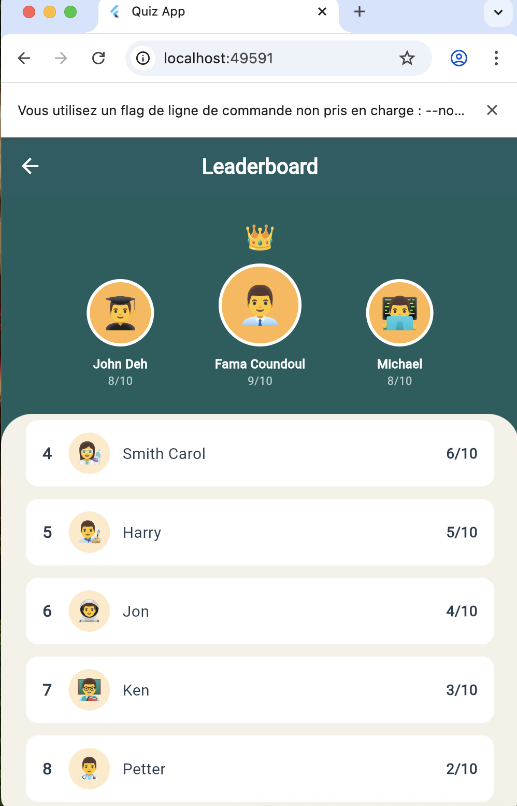

# Application Quiz Flutter avec BLoC

## 📱 Vue d'ensemble

Application de quiz interactive utilisant **BLoC (Business Logic Component)** comme solution de gestion d'état avancée, remplaçant l'utilisation initiale de `setState()`.

<div style="display: flex; gap: 20px;">
  
  
  
</div>


## 🏗️ Architecture du Projet

```
lib/
├── business_logic/
│   └── bloc/
│       ├── quiz_bloc.dart       # BLoC principal
│       ├── quiz_event.dart      # Événements
│       └── quiz_state.dart      # États
├── data/
│   ├── models/
│   │   └── question_model.dart      # Modèle de données
│   └── repositories/
│       └── question_repository.dart  # Repository
├── presentation/
│   ├── constants/
│   │   └── app_colors.dart          # Constantes
│   └── pages/
│       ├── welcome_page_bloc.dart       # Page d'accueil
│       ├── quiz_page_bloc.dart          # Page de quiz
│       └── leaderboard_page_bloc.dart   # Classement
└── main_bloc.dart                       # Point d'entrée
```

## 🎯 Concept BLoC : Le Pattern Réactif

### Qu'est-ce que BLoC ?

**BLoC = Business Logic Component**

C'est un pattern de conception qui sépare complètement :
- 🎨 **UI (Présentation)** : Ce que l'utilisateur voit
- 🧠 **Logic (Business)** : Comment l'app fonctionne
- 📊 **Data** : Les données de l'app

### Flux de Données BLoC

```
┌─────────────────────────────────────────────────┐
│                    UI (Widget)                   │
│  - Affiche l'état actuel                        │
│  - Envoie des événements                        │
└────────────┬────────────────────┬───────────────┘
             │                    │
       Envoie Event          Écoute State
             │                    │
             ▼                    │
┌────────────────────────────────┼───────────────┐
│         QuizBloc                │               │
│                                 │               │
│  ┌─────────────┐       ┌──────▼──────┐        │
│  │   Events    │──────▶│   States    │────────┤
│  │             │       │             │        │
│  │ - InitQuiz  │       │ - Initial   │        │
│  │ - Select    │       │ - InProgress│        │
│  │ - Next      │       │ - Completed │        │
│  │ - Timer     │       │ - Error     │        │
│  └─────────────┘       └─────────────┘        │
│                                                 │
│  Business Logic (handlers)                     │
│  - _onInitQuiz()                               │
│  - _onSelectAnswer()                           │
│  - _onNextQuestion()                           │
│  - _onDecrementTimer()                         │
└─────────────────────────────────────────────────┘
             │
       Accède aux données
             │
             ▼
┌─────────────────────────────────────────────────┐
│              Data Layer                          │
│  - Models (Question)                            │
│  - Repositories (QuestionRepository)            │
└─────────────────────────────────────────────────┘
```

## 🔑 Les 3 Composants Principaux

### 1. Events (Événements)

**Ce que l'utilisateur fait** → Actions déclenchées par l'UI

```dart
// quiz_event.dart
abstract class QuizEvent extends Equatable {
  const QuizEvent();
}

// Exemples d'événements
class InitQuizEvent extends QuizEvent {
  final List<Question> questions;
  final String userName;
  // L'utilisateur démarre le quiz
}

class SelectAnswerEvent extends QuizEvent {
  final String answer;
  // L'utilisateur sélectionne une réponse
}

class NextQuestionEvent extends QuizEvent {
  // L'utilisateur passe à la question suivante
}

class DecrementTimerEvent extends QuizEvent {
  // Le timer décrémente (chaque seconde)
}
```

**Dans l'UI** :
```dart
// Envoyer un événement au BLoC
context.read<QuizBloc>().add(SelectAnswerEvent('Paris'));
```

### 2. States (États)

**Ce que l'utilisateur voit** → Représentation de l'état de l'app

```dart
// quiz_state.dart
abstract class QuizState extends Equatable {
  const QuizState();
}

// États possibles
class QuizInitial extends QuizState {
  // État de départ, avant de commencer
}

class QuizInProgress extends QuizState {
  final List<Question> questions;
  final int currentQuestionIndex;
  final int score;
  final String? selectedAnswer;
  final int timeRemaining;
  final bool isTimerRunning;
  final String userName;
  
  // Quiz en cours avec toutes les infos nécessaires
}

class QuizCompleted extends QuizState {
  final String userName;
  final int finalScore;
  final int totalQuestions;
  
  // Quiz terminé avec le score final
}

class QuizError extends QuizState {
  final String message;
  // Erreur survenue
}
```

**Dans l'UI** :
```dart
// Écouter les changements d'état
BlocBuilder<QuizBloc, QuizState>(
  builder: (context, state) {
    if (state is QuizInProgress) {
      return Text('Score: ${state.score}');
    }
    return Container();
  },
)
```

### 3. BLoC (Business Logic Component)

**Le cerveau de l'app** → Traite les événements et produit des états

```dart
// quiz_bloc.dart
class QuizBloc extends Bloc<QuizEvent, QuizState> {
  QuizBloc() : super(const QuizInitial()) {
    // Enregistrer les handlers
    on<InitQuizEvent>(_onInitQuiz);
    on<SelectAnswerEvent>(_onSelectAnswer);
    on<NextQuestionEvent>(_onNextQuestion);
  }

  // Handler : Traiter l'événement InitQuiz
  Future<void> _onInitQuiz(
    InitQuizEvent event,
    Emitter<QuizState> emit,
  ) async {
    // Créer un nouvel état QuizInProgress
    emit(QuizInProgress(
      questions: event.questions,
      currentQuestionIndex: 0,
      score: 0,
      timeRemaining: 30,
      isTimerRunning: true,
      userName: event.userName,
    ));
  }

  // Handler : Traiter la sélection de réponse
  Future<void> _onSelectAnswer(
    SelectAnswerEvent event,
    Emitter<QuizState> emit,
  ) async {
    final currentState = state as QuizInProgress;
    
    // Vérifier si la réponse est correcte
    final isCorrect = event.answer == currentState.currentQuestion?.correctAnswer;
    final newScore = isCorrect ? currentState.score + 1 : currentState.score;

    // Émettre un nouvel état avec le score mis à jour
    emit(currentState.copyWith(
      selectedAnswer: event.answer,
      score: newScore,
      isTimerRunning: false,
    ));
  }
}
```

## 🔄 Flux Complet : Exemple Concret

### Scénario : L'utilisateur sélectionne une réponse

```
1. UI (QuizPageBloc)
   └─> L'utilisateur tape sur "Paris"
       └─> context.read<QuizBloc>().add(SelectAnswerEvent('Paris'))

2. QuizBloc reçoit l'événement
   └─> on<SelectAnswerEvent> déclenche _onSelectAnswer()
       
3. _onSelectAnswer() traite l'événement
   ├─> Récupère l'état actuel (QuizInProgress)
   ├─> Vérifie si "Paris" est la bonne réponse
   ├─> Calcule le nouveau score
   └─> emit(nouvel état avec score mis à jour)

4. BlocBuilder dans l'UI détecte le nouvel état
   └─> builder() est appelé avec le nouvel état
       └─> L'UI se reconstruit automatiquement
           └─> Affiche le nouveau score
```

## 🎨 Widgets BLoC

### BlocProvider

**Fournit le BLoC aux widgets enfants**

```dart
// Dans main.dart
BlocProvider(
  create: (context) => QuizBloc(),
  child: MaterialApp(
    home: WelcomePageBloc(),
  ),
)
```

### BlocBuilder

**Reconstruit l'UI quand l'état change**

```dart
BlocBuilder<QuizBloc, QuizState>(
  builder: (context, state) {
    if (state is QuizInProgress) {
      return Text('Score: ${state.score}');
    }
    return Container();
  },
)
```

### BlocListener

**Écoute les changements pour des effets de bord (navigation, snackbars)**

```dart
BlocListener<QuizBloc, QuizState>(
  listener: (context, state) {
    if (state is QuizCompleted) {
      // Naviguer vers le leaderboard
      Navigator.push(...);
    }
  },
  child: MyWidget(),
)
```

### BlocConsumer

**Combine BlocBuilder + BlocListener**

```dart
BlocConsumer<QuizBloc, QuizState>(
  listener: (context, state) {
    // Pour les effets de bord
    if (state is QuizCompleted) {
      Navigator.push(...);
    }
  },
  builder: (context, state) {
    // Pour construire l'UI
    if (state is QuizInProgress) {
      return QuizWidget(state: state);
    }
    return Container();
  },
)
```

## 💡 Avantages de BLoC

### 1. Séparation Totale UI / Logic

```dart
// ❌ AVANT (setState)
class _QuizPageState extends State<QuizPage> {
  int score = 0;
  
  void checkAnswer(String answer) {
    setState(() {
      if (answer == correctAnswer) score++;
    });
  }
  
  @override
  Widget build(BuildContext context) {
    return Text('Score: $score');
  }
}

// ✅ APRÈS (BLoC)
// Logic dans quiz_bloc.dart
class QuizBloc {
  void checkAnswer(String answer) {
    final isCorrect = answer == correctAnswer;
    emit(state.copyWith(score: state.score + 1));
  }
}

// UI dans quiz_page_bloc.dart
BlocBuilder<QuizBloc, QuizState>(
  builder: (context, state) => Text('Score: ${state.score}'),
)
```

### 2. Testabilité Maximale

```dart
// Tests unitaires du BLoC (sans UI)
test('selectAnswer increments score when correct', () {
  final bloc = QuizBloc();
  
  bloc.add(InitQuizEvent(questions, 'User'));
  bloc.add(SelectAnswerEvent('Paris')); // Bonne réponse
  
  expect(
    bloc.stream,
    emitsInOrder([
      isA<QuizInProgress>().having((s) => s.score, 'score', 1),
    ]),
  );
});
```

### 3. Gestion Asynchrone Native

```dart
// Le BLoC gère naturellement les opérations async
Future<void> _onInitQuiz(
  InitQuizEvent event,
  Emitter<QuizState> emit,
) async {
  emit(QuizLoading()); // État de chargement
  
  try {
    final questions = await repository.loadQuestions();
    emit(QuizInProgress(questions: questions, ...));
  } catch (e) {
    emit(QuizError(e.toString()));
  }
}
```

### 4. États Immutables

```dart
// Les états ne peuvent pas être modifiés directement
final state = QuizInProgress(score: 5, ...);
// state.score = 10; // ❌ ERREUR : impossible

// ✅ Créer un nouvel état
final newState = state.copyWith(score: 10);
```

### 5. Debug Facile avec BlocObserver

```dart
class MyBlocObserver extends BlocObserver {
  @override
  void onEvent(Bloc bloc, Object? event) {
    print('Event: $event');
    super.onEvent(bloc, event);
  }

  @override
  void onTransition(Bloc bloc, Transition transition) {
    print('Transition: $transition');
    super.onTransition(bloc, transition);
  }

  @override
  void onError(BlocBase bloc, Object error, StackTrace stackTrace) {
    print('Error: $error');
    super.onError(bloc, error, stackTrace);
  }
}

// Dans main.dart
void main() {
  Bloc.observer = MyBlocObserver();
  runApp(MyApp());
}
```

## 📊 BLoC vs Provider

| Aspect | BLoC | Provider |
|--------|------|----------|
| **Courbe d'apprentissage** | Plus steep | Plus simple |
| **Boilerplate** | Plus de code | Moins de code |
| **Structure** | Très structuré | Flexible |
| **Testabilité** | Excellente | Bonne |
| **Async** | Natif (Streams) | Futures |
| **Debug** | BlocObserver | DevTools |
| **Séparation** | Totale (Events/States) | ChangeNotifier |
| **Best pour** | Apps complexes | Apps moyennes |

## 🔧 Installation et Configuration

### 1. Ajouter les dépendances

```yaml
# pubspec.yaml
dependencies:
  flutter_bloc: ^8.1.3
  equatable: ^2.0.5  # Pour comparer les états
```

### 2. Installer les packages

```bash
flutter pub get
```

### 3. Structure du projet

```bash
lib/
├── business_logic/
│   └── bloc/
│       ├── quiz_bloc.dart
│       ├── quiz_event.dart
│       └── quiz_state.dart
├── data/
│   ├── models/
│   └── repositories/
└── presentation/
    └── pages/
```

### 4. Configurer le BLoC dans main.dart

```dart
void main() {
  runApp(
    BlocProvider(
      create: (context) => QuizBloc(),
      child: MyApp(),
    ),
  );
}
```

## 🎯 Utilisation Pratique

### Envoyer un événement

```dart
// Méthode 1 : context.read (recommandé)
context.read<QuizBloc>().add(SelectAnswerEvent('Paris'));

// Méthode 2 : BlocProvider.of
BlocProvider.of<QuizBloc>(context).add(SelectAnswerEvent('Paris'));
```

### Écouter l'état

```dart
// Pour construire l'UI
BlocBuilder<QuizBloc, QuizState>(
  builder: (context, state) {
    if (state is QuizInProgress) {
      return Text('Score: ${state.score}');
    }
    return Container();
  },
)

// Pour les effets de bord
BlocListener<QuizBloc, QuizState>(
  listener: (context, state) {
    if (state is QuizCompleted) {
      ScaffoldMessenger.of(context).showSnackBar(
        SnackBar(content: Text('Quiz terminé!')),
      );
    }
  },
  child: MyWidget(),
)
```

## 🎓 Concepts Avancés

### Equatable

**Pourquoi ?** Pour comparer facilement les états

```dart
// Sans Equatable
QuizInProgress(score: 5) == QuizInProgress(score: 5) // false ❌

// Avec Equatable
class QuizInProgress extends Equatable {
  final int score;
  
  @override
  List<Object?> get props => [score];
}

QuizInProgress(score: 5) == QuizInProgress(score: 5) // true ✅
```

### copyWith Pattern

**Créer un nouvel état en modifiant certains champs**

```dart
class QuizInProgress extends QuizState {
  final int score;
  final int timeRemaining;
  
  QuizInProgress copyWith({
    int? score,
    int? timeRemaining,
  }) {
    return QuizInProgress(
      score: score ?? this.score,
      timeRemaining: timeRemaining ?? this.timeRemaining,
    );
  }
}

// Usage
final newState = currentState.copyWith(score: 10);
```

### Emitter

**Émettre plusieurs états dans un handler**

```dart
Future<void> _onLoadQuestions(
  LoadQuestionsEvent event,
  Emitter<QuizState> emit,
) async {
  emit(QuizLoading());  // Afficher un loader
  
  await Future.delayed(Duration(seconds: 1));
  
  final questions = await repository.load();
  emit(QuizLoaded(questions));  // Afficher les questions
}
```

## 🐛 Problèmes Courants

### Problème 1 : "BlocProvider not found"

```dart
// ❌ MAUVAIS
Navigator.push(
  context,
  MaterialPageRoute(builder: (_) => QuizPageBloc()),
);

// ✅ BON : Passer le BLoC existant
Navigator.push(
  context,
  MaterialPageRoute(
    builder: (_) => BlocProvider.value(
      value: context.read<QuizBloc>(),
      child: QuizPageBloc(),
    ),
  ),
);
```

### Problème 2 : "Bad state: Cannot add new events after calling close"

```dart
// ❌ MAUVAIS : Envoyer un événement après close()
@override
void dispose() {
  bloc.add(SomeEvent());  // ❌ Erreur
  super.dispose();
}

// ✅ BON : Ne rien faire, le BLoC se ferme automatiquement
```

### Problème 3 : États non détectés

```dart
// ❌ MAUVAIS : Oubli de Equatable
class QuizInProgress extends QuizState {
  final int score;
}

// ✅ BON : Avec Equatable
class QuizInProgress extends Equatable {
  final int score;
  
  @override
  List<Object?> get props => [score];
}
```

## 📚 Ressources

- [Documentation officielle BLoC](https://bloclibrary.dev)
- [Flutter BLoC Package](https://pub.dev/packages/flutter_bloc)
- [Equatable Package](https://pub.dev/packages/equatable)
- [BLoC Architecture](https://www.didierboelens.com/2018/08/reactive-programming-streams-bloc/)

## 🎉 Conclusion

BLoC est un pattern puissant pour :
- ✅ Apps complexes avec beaucoup d'états
- ✅ Équipes de développement
- ✅ Code hautement testable
- ✅ Séparation stricte UI/Logic

##  Licence

Ce projet est développé à des fins pédagogiques.

---

**Développé avec ❤️ en Flutter + BLoC**